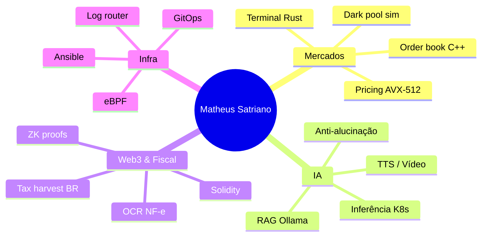
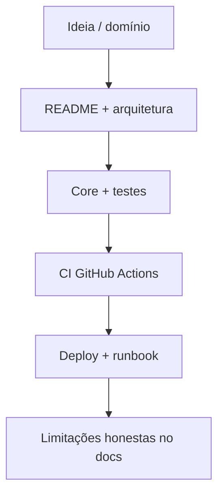

 

---

## Índice

| | |
|:---:|---|
| **1** | [Sobre mim](#-sobre-mim) |
| **2** | [Em números](#-em-números) |
| **3** | [Pilares de atuação](#-pilares-de-atuação) |
| **4** | [Projetos em destaque](#-projetos-em-destaque) |
| **5** | [Portfólio completo por área](#-portfólio-completo-por-área) |
| **6** | [Como eu construo software](#-como-eu-construo-software) |
| **7** | [Stack e ferramentas](#-stack-e-ferramentas) |
| **8** | [Formação e objetivos](#-formação-e-objetivos) |
| **9** | [Contato e apoio](#-contato-e-apoio) |
| **10** | [Estatísticas GitHub](#-estatísticas-github) |

---

## Sobre mim

Olá! Eu sou o **Matheus Rodrigues Satriano**, graduando em **Ciência da Computação** e desenvolvedor com foco em **back-end**, **sistemas de baixa latência** e **produtos de dados**.

Minha trajetória une três mundos que raramente aparecem juntos no mesmo perfil:

1. **Mercados e infraestrutura de trading** — order books, precificação de opções, terminais, simuladores de impacto e chaos engineering para bots.  
2. **Inteligência artificial aplicada** — RAG 100% local, clusters de inferência, TTS, pipelines de vídeo e frameworks de QA para LLMs.  
3. **Web3 e compliance** — contratos inteligentes, provas zero-knowledge, análise de honeypots e ferramentas fiscais para o **Brasil**.

Não busco apenas “ter repositórios no GitHub”: cada projeto do portfólio inclui **README detalhado em português**, guias de **arquitetura**, **deploy**, **operação**, **testes** e **CI** — documentação que eu gostaria de encontrar ao abrir um projeto sério pela primeira vez.

> **Missão:** entregar software **rápido**, **observável** e **honesto** sobre o que já está implementado — com caminho claro do clone local ao deploy.

---

## Em números

<table>
<tr>
<td align="center" width="25%">
<h2>30</h2>
repositórios públicos
</td>
<td align="center" width="25%">
<h2>6</h2>
domínios técnicos
</td>
<td align="center" width="25%">
<h2>v1.0</h2>
release documentada
</td>
<td align="center" width="25%">
<h2>pt-BR</h2>
docs operacionais
</td>
</tr>
</table>

| Domínio | Quantidade | Exemplos |
|---------|:----------:|----------|
| **HFT / Quant** | 8 | Order book, AVX-512, SMC scanner, terminal, dark pool, chaos, tax harvest, MEV educacional |
| **IA / ML** | 7 | RAG vault, cluster inferência, TTS, vídeo autônomo, trends, deepfake bridge, lo-fi |
| **Web3** | 5 | Staking, ZK identity, P2P order book, honeypot analyzer, Fabric ledger |
| **Produto / SaaS** | 4 | Dashboard analytics, B2B boilerplate, family treasury, fiscal OCR |
| **Sistemas / Infra** | 6 | Workstation Ansible, eBPF tracer, hypervisor, GitOps, log router |

---

## Pilares de atuação

<table>
<tr>
<td width="50%" valign="top">

### Mercados e performance

- Matching e livro de ofertas em **C++**  
- Precificação **AVX-512** sem GPU  
- Feeds WebSocket e features **SMC**  
- Terminais **Rust** para risco e carteira  
- Simulação de **impacto de mercado**  

</td>
<td width="50%" valign="top">

### IA confiável e local

- **RAG offline** com Ollama e citações  
- Gateway de **inferência distribuída**  
- **TTS** e clonagem de voz self-hosted  
- Pipelines de **vídeo curto** automatizados  
- **Trap suites** contra alucinação em LLMs  

</td>
</tr>
<tr>
<td width="50%" valign="top">

### Web3 e segurança

- **Solidity** + Hardhat + testes  
- **ZK proofs** e verifiers on-chain  
- Análise estática **honeypot / rug**  
- Order book **P2P** com gossip  
- MEV **educacional** em testnet  

</td>
<td width="50%" valign="top">

### Brasil e produto

- **OCR fiscal** e categorização  
- **Tax-loss harvesting** com wash sale  
- Dashboard **multicanal** (Next.js)  
- **SaaS B2B** Supabase + Stripe  
- Cofres e metas **familiares**  

</td>
</tr>
</table>

---

## Projetos em destaque

Os repositórios abaixo são a **vitrine técnica** do perfil — cada um com código do núcleo, testes e documentação completa.

---

### Motor de livro de ofertas (HFT)

| | |
|---|---|
| **O quê** | Motor de matching FIFO com sharding por símbolo, filas lock-free e benchmarks em microssegundos |
| **Stack** | `C++20` · `gRPC` · `ZeroMQ` · `CMake` |
| **Para quem** | Quants, engenheiros HFT e pesquisa de microestrutura |
| **Destaque** | Throughput documentado > 2M ordens/s (8 shards) |

---

### Precificação de opções AVX-512

| | |
|---|---|
| **O quê** | Black-Scholes e Monte Carlo vetorizados na CPU, com benchmark escalar vs SIMD |
| **Stack** | `C++` · `AVX-512` · `CMake` |
| **Para quem** | Desks de opções e engenharia de performance |
| **Destaque** | Speedup ~7× documentado frente ao kernel escalar |

---

### Cofre RAG local “Second Mind”

| | |
|---|---|
| **O quê** | Ingestão de documentos, busca semântica e respostas com Ollama — dados não saem da máquina |
| **Stack** | `Python` · `FastAPI` · `Ollama` |
| **Para quem** | Advogados, pesquisadores e PMEs com requisito de privacidade |
| **Destaque** | API `/ingest` e `/query` com fontes citadas |

---

### Super terminal de trading (TUI)

| | |
|---|---|
| **O quê** | Interface estilo terminal profissional: PnL, exposição, kill switch e conectores |
| **Stack** | `Rust` · `Ratatui` · `Tokio` |
| **Para quem** | Traders e gestão de risco |
| **Destaque** | < 25 MB de RAM, refresh ~30 FPS |

---

### Dashboard analítico multicanal

| | |
|---|---|
| **O quê** | RPM, retenção e conversão consolidados com gráficos Recharts |
| **Stack** | `Next.js 14` · `Tailwind` · `TypeScript` |
| **Para quem** | Creators e growth |
| **Destaque** | UI pronta para demo e deploy Vercel |

---

### Fiscal e mercado brasileiro

<table>
<tr>
<td width="50%">

**[tax-loss-harvesting-engine](https://github.com/SrSatriano/tax-loss-harvesting-engine)**  
Harvest fiscal automatizado, substitutos correlacionados e regras de **wash sale**.  
`Node.js` · `Express` · testes nativos

</td>
<td width="50%">

**[fiscal-data-ocr-engine](https://github.com/SrSatriano/fiscal-data-ocr-engine)**  
Extração de CNPJ, totais e categorização de notas (combustível, software, etc.).  
`Python` · `FastAPI` · `pytest`

</td>
</tr>
</table>

---

## Portfólio completo por área

<strong>HFT, quant e trading (01–03, 11, 16, 19–21)</strong>

 

| Repo | Descrição curta |
|------|-----------------|
| [ultra-low-latency-order-book-engine](https://github.com/SrSatriano/ultra-low-latency-order-book-engine) | Matching C++ · microssegundos |
| [smc-liquidity-scanner](https://github.com/SrSatriano/smc-liquidity-scanner) | SMC · FVG · ML em tempo real |
| [unified-trading-super-terminal](https://github.com/SrSatriano/unified-trading-super-terminal) | TUI Rust · risco e carteira |
| [avx512-options-pricing-engine](https://github.com/SrSatriano/avx512-options-pricing-engine) | Black-Scholes / MC AVX-512 |
| [mempool-arbitrage-mev-bot](https://github.com/SrSatriano/mempool-arbitrage-mev-bot) | MEV educacional · testnet |
| [chaos-engineering-trading-toolkit](https://github.com/SrSatriano/chaos-engineering-trading-toolkit) | Chaos para bots em homologação |
| [dark-pool-market-impact-simulator](https://github.com/SrSatriano/dark-pool-market-impact-simulator) | Impacto · Almgren-Chriss |
| [tax-loss-harvesting-engine](https://github.com/SrSatriano/tax-loss-harvesting-engine) | Harvest fiscal BR |

<strong>Inteligência artificial (04–08, 25–27)</strong>

 

| Repo | Descrição curta |
|------|-----------------|
| [local-rag-second-mind-vault](https://github.com/SrSatriano/local-rag-second-mind-vault) | RAG offline · Ollama |
| [distributed-ai-inference-cluster](https://github.com/SrSatriano/distributed-ai-inference-cluster) | Gateway LLM · Kubernetes |
| [voice-cloning-tts-api-gateway](https://github.com/SrSatriano/voice-cloning-tts-api-gateway) | TTS e clonagem · Celery |
| [autonomous-short-form-video-pipeline](https://github.com/SrSatriano/autonomous-short-form-video-pipeline) | Tema → MP4 9:16 |
| [viral-trend-sentiment-predictor](https://github.com/SrSatriano/viral-trend-sentiment-predictor) | Trends · scraper + ML |
| [realtime-deepfake-streaming-bridge](https://github.com/SrSatriano/realtime-deepfake-streaming-bridge) | Webcam · CUDA · pesquisa |
| [cognitive-bias-hallucination-trap](https://github.com/SrSatriano/cognitive-bias-hallucination-trap) | QA adversarial LLM |
| [algorithmic-lofi-audio-generator](https://github.com/SrSatriano/algorithmic-lofi-audio-generator) | Trilha lo-fi por cenas |

<strong>Produto, analytics e SaaS (09, 12–14)</strong>

 

| Repo | Descrição curta |
|------|-----------------|
| [multi-channel-analytics-dashboard](https://github.com/SrSatriano/multi-channel-analytics-dashboard) | Dashboard Next.js |
| [fiscal-data-ocr-engine](https://github.com/SrSatriano/fiscal-data-ocr-engine) | OCR fiscal BR |
| [enterprise-b2b-saas-boilerplate](https://github.com/SrSatriano/enterprise-b2b-saas-boilerplate) | Auth · Stripe · Supabase |
| [family-treasury-dao-tracker](https://github.com/SrSatriano/family-treasury-dao-tracker) | Cofres e metas familiares |

<strong>Web3 e blockchain (10, 22–24, 28)</strong>

 

| Repo | Descrição curta |
|------|-----------------|
| [tokenomics-staking-protocol](https://github.com/SrSatriano/tokenomics-staking-protocol) | ERC-20 · staking · Hardhat |
| [identity-vault-zk-proofs](https://github.com/SrSatriano/identity-vault-zk-proofs) | ZK · Circom · Groth16 |
| [p2p-orderbook-gossip](https://github.com/SrSatriano/p2p-orderbook-gossip) | Order book · libp2p |
| [honeypot-rugpull-analyzer](https://github.com/SrSatriano/honeypot-rugpull-analyzer) | Slither · pré-trade |
| [cross-border-ledger-fabric](https://github.com/SrSatriano/cross-border-ledger-fabric) | Hyperledger Fabric |

<strong>Sistemas, infra e performance (15, 17–18, 29–30)</strong>

 

| Repo | Descrição curta |
|------|-----------------|
| [zero-to-hero-workstation-provisioner](https://github.com/SrSatriano/zero-to-hero-workstation-provisioner) | Ansible · estação dev |
| [ebpf-latency-tracer-financial](https://github.com/SrSatriano/ebpf-latency-tracer-financial) | RTT µs · kernel |
| [hypervisor-ai-isolation](https://github.com/SrSatriano/hypervisor-ai-isolation) | Isolamento LLM · KVM |
| [gitops-infra-state-reconciler](https://github.com/SrSatriano/gitops-infra-state-reconciler) | GitOps · anti-drift |
| [high-compression-log-router](https://github.com/SrSatriano/high-compression-log-router) | Logs · Zstd · Rust |

---

## Como eu construo software

| Princípio | Na prática |
|-----------|------------|
| **Documentação primeiro** | README em pt-BR, `ARCHITECTURE`, `DEPLOYMENT`, `OPERATIONS` |
| **Testes reproduzíveis** | Comando único no README (`pytest`, `cargo test`, `npm test`, …) |
| **Performance mensurável** | Benchmarks com números e metodologia |
| **Segurança** | Sem segredos no Git; `SECURITY.md` em cada repo |
| **Transparência** | Seções *Limitações* e *Roadmap* quando o escopo é parcial |

---

## Stack e ferramentas

### Linguagens

  
  
  
  
  
  
  

### Frameworks e runtime

  
  
  
  
  
  

### Dados, infra e observabilidade

  
  
  
  
  
  
  
  

---

## Formação e objetivos

| | |
|---|---|
| **Graduação** | Ciência da Computação *(em andamento)* |
| **Foco atual** | Back-end, HFT, IA local, Web3 |
| **Pesquisa de interesse** | Computação quântica · algoritmos combinatórios |
| **Objetivo de carreira** | Construir tecnologia para **mercados financeiros** e produtos de **IA confiável** com impacto real |

**Idiomas:** português (nativo) · inglês (leitura técnica e documentação)

---

## Contato e apoio

| Canal | Link |
|-------|------|
| **E-mail** | [matheussatriano@hotmail.com](mailto:matheussatriano@hotmail.com) |
| **LinkedIn** | [linkedin.com/in/matheus-rodrigues-satriano](https://www.linkedin.com/in/matheus-rodrigues-satriano) |
| **Google Developers** | [g.dev/satriano](https://g.dev/satriano) |
| **GitHub** | [github.com/SrSatriano](https://github.com/SrSatriano) |

 

Se algum projeto te ajudou, um café mantém a motivação para documentar e publicar a próxima versão.

---

## Estatísticas GitHub

 

 

 

---

**Obrigado pela visita.**

*Se chegou até aqui, explore um repositório — comece pelo* [order book](https://github.com/SrSatriano/ultra-low-latency-order-book-engine) *ou pelo* [RAG local](https://github.com/SrSatriano/local-rag-second-mind-vault)*.*

 

