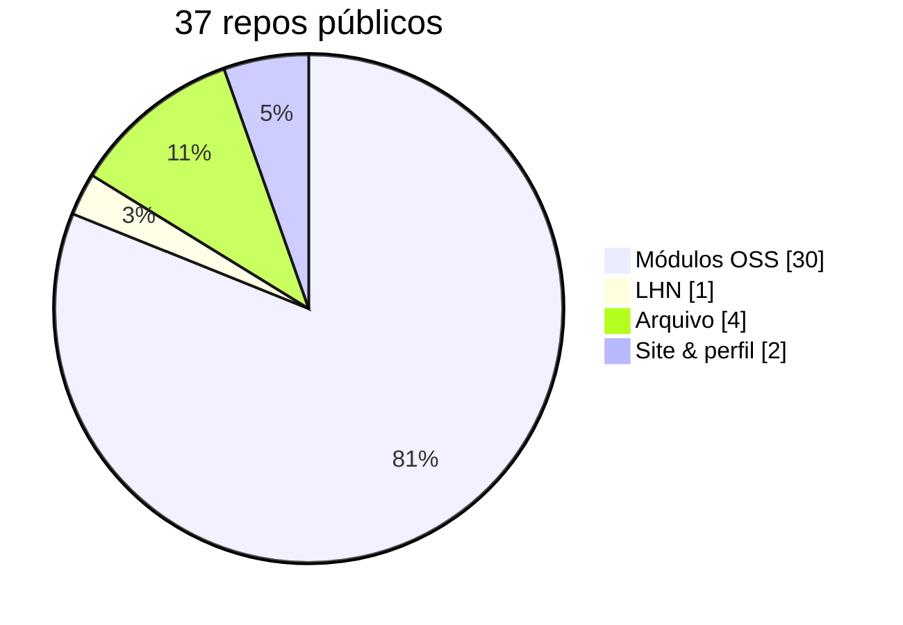

<div align="center">

### Back-end · mercados · IA local · Web3 · Brasil


<br/>

<a href="https://srsatriano.github.io/portfolio-matheus-satriano/">
  
</a>
<a href="https://www.linkedin.com/in/matheus-rodrigues-satriano">
  
</a>
<a href="mailto:matheussatriano@hotmail.com">
  
</a>

<br/><br/>


</div>

---

## Navegação

| | Ir para |
|:---:|---|
| ★ | [**LHN Sovereign V90**](#lhn) |
| → | [Sobre](#sobre) · [Destaques](#destaques) · [Tecnologias](#stack) · [GitHub](#github) · [Repos](#repos) · [Contato](#contato) |

---

<a id="sobre"></a>

## Sobre

Sou **Matheus Rodrigues Satriano**, graduando em **Ciência da Computação**. Trabalho com **back-end**, **mercado**, **latência** e **IA na máquina** — o que não precisa ir pra nuvem, prefiro rodar local.

No GitHub deixo **público** o [LHN](https://github.com/SrSatriano/LHN-V90-IA), **30 módulos** por tema, o [site de portfólio](https://github.com/SrSatriano/portfolio-matheus-satriano) e quatro projetos de estudo. Tudo documentado em **português**.

**Site:** [srsatriano.github.io/portfolio-matheus-satriano](https://srsatriano.github.io/portfolio-matheus-satriano/) · **Mapa:** [#github no site](https://srsatriano.github.io/portfolio-matheus-satriano/#github)

---

<a id="lhn"></a>

## LHN Sovereign V90

<table>
<tr>
<td width="52%" valign="top">

**Terminal quant** que eu mais desenvolvo: **Bybit V5**, painel **Next.js** (`9090`), API **FastAPI** (`9002`), risco e IA onde faz sentido.

Licença **PolyForm Noncommercial** (não é MIT).

```
Next.js (9090) ──► FastAPI (9002) ──► Bybit · IA · workspace
```

</td>
<td width="48%" valign="top" align="center">

<a href="https://github.com/SrSatriano/LHN-V90-IA">

</a>

</td>
</tr>
</table>

---

<a id="destaques"></a>

## Destaques

<div align="center">

<a href="https://github.com/SrSatriano/portfolio-matheus-satriano">

</a>
<a href="https://github.com/SrSatriano/ultra-low-latency-order-book-engine">

</a>
<a href="https://github.com/SrSatriano/local-rag-second-mind-vault">

</a>

</div>

| Projeto | Foco |
|---------|------|
| [Order Book](https://github.com/SrSatriano/ultra-low-latency-order-book-engine) | C++ · matching · testes |
| [AVX-512 Pricing](https://github.com/SrSatriano/avx512-options-pricing-engine) | SIMD na CPU |
| [Fiscal OCR](https://github.com/SrSatriano/fiscal-data-ocr-engine) · [Tax Harvest](https://github.com/SrSatriano/tax-loss-harvesting-engine) | Brasil |
| [Analytics Dashboard](https://github.com/SrSatriano/multi-channel-analytics-dashboard) | Next.js |
| [Log Router](https://github.com/SrSatriano/high-compression-log-router) | Rust · Zstd |

---

<a id="stack"></a>

## Tecnologias

### Linguagens


### Frameworks & bibliotecas


<p>
  
  
  
  
  
  
  
  
</p>

### Infra, dados & DevOps


<p>
  
  
  
  
  
  
  
</p>

### Mercado, performance & Web3

<p>
  
  
  
  
  
  
  
  
  
</p>

### Ferramentas


<p>
  
  
  
  
  
  
</p>

---

<a id="github"></a>

## Atividade no GitHub

<div align="center">


<br/>


</div>



---

<a id="repos"></a>

## Repositórios

<details open>
<summary><b>Trading & quant (9 + LHN)</b></summary>

| Repo | Nota |
|------|------|
| [**LHN-V90-IA**](https://github.com/SrSatriano/LHN-V90-IA) | sistema principal |
| [ultra-low-latency-order-book-engine](https://github.com/SrSatriano/ultra-low-latency-order-book-engine) | order book |
| [smc-liquidity-scanner](https://github.com/SrSatriano/smc-liquidity-scanner) | SMC |
| [unified-trading-super-terminal](https://github.com/SrSatriano/unified-trading-super-terminal) | TUI Rust |
| [avx512-options-pricing-engine](https://github.com/SrSatriano/avx512-options-pricing-engine) | SIMD |
| [mempool-arbitrage-mev-bot](https://github.com/SrSatriano/mempool-arbitrage-mev-bot) | educacional |
| [chaos-engineering-trading-toolkit](https://github.com/SrSatriano/chaos-engineering-trading-toolkit) | chaos |
| [dark-pool-market-impact-simulator](https://github.com/SrSatriano/dark-pool-market-impact-simulator) | simulador |
| [tax-loss-harvesting-engine](https://github.com/SrSatriano/tax-loss-harvesting-engine) | fiscal BR |

</details>

<details>
<summary><b>IA & mídia (8)</b></summary>

| Repo | Nota |
|------|------|
| [local-rag-second-mind-vault](https://github.com/SrSatriano/local-rag-second-mind-vault) | RAG offline |
| [distributed-ai-inference-cluster](https://github.com/SrSatriano/distributed-ai-inference-cluster) | LLM gateway |
| [voice-cloning-tts-api-gateway](https://github.com/SrSatriano/voice-cloning-tts-api-gateway) | TTS |
| [autonomous-short-form-video-pipeline](https://github.com/SrSatriano/autonomous-short-form-video-pipeline) | vídeo |
| [viral-trend-sentiment-predictor](https://github.com/SrSatriano/viral-trend-sentiment-predictor) | trends |
| [realtime-deepfake-streaming-bridge](https://github.com/SrSatriano/realtime-deepfake-streaming-bridge) | CUDA |
| [cognitive-bias-hallucination-trap](https://github.com/SrSatriano/cognitive-bias-hallucination-trap) | QA LLM |
| [algorithmic-lofi-audio-generator](https://github.com/SrSatriano/algorithmic-lofi-audio-generator) | áudio |

</details>

<details>
<summary><b>Produto · Web3 · Infra (13)</b></summary>

| Repo | Nota |
|------|------|
| [multi-channel-analytics-dashboard](https://github.com/SrSatriano/multi-channel-analytics-dashboard) | dashboard |
| [fiscal-data-ocr-engine](https://github.com/SrSatriano/fiscal-data-ocr-engine) | OCR |
| [enterprise-b2b-saas-boilerplate](https://github.com/SrSatriano/enterprise-b2b-saas-boilerplate) | SaaS |
| [family-treasury-dao-tracker](https://github.com/SrSatriano/family-treasury-dao-tracker) | tesouraria |
| [tokenomics-staking-protocol](https://github.com/SrSatriano/tokenomics-staking-protocol) | staking |
| [identity-vault-zk-proofs](https://github.com/SrSatriano/identity-vault-zk-proofs) | ZK |
| [p2p-orderbook-gossip](https://github.com/SrSatriano/p2p-orderbook-gossip) | libp2p |
| [honeypot-rugpull-analyzer](https://github.com/SrSatriano/honeypot-rugpull-analyzer) | tokens |
| [cross-border-ledger-fabric](https://github.com/SrSatriano/cross-border-ledger-fabric) | Fabric |
| [zero-to-hero-workstation-provisioner](https://github.com/SrSatriano/zero-to-hero-workstation-provisioner) | Ansible |
| [ebpf-latency-tracer-financial](https://github.com/SrSatriano/ebpf-latency-tracer-financial) | eBPF |
| [hypervisor-ai-isolation](https://github.com/SrSatriano/hypervisor-ai-isolation) | hypervisor |
| [gitops-infra-state-reconciler](https://github.com/SrSatriano/gitops-infra-state-reconciler) | GitOps |
| [high-compression-log-router](https://github.com/SrSatriano/high-compression-log-router) | logs |

</details>

<details>
<summary><b>Arquivo & estudos (4)</b></summary>

| Repo | O que é |
|------|---------|
| [IA-Financeira](https://github.com/SrSatriano/IA-Financeira) | primeiras IAs + finanças ★1 |
| [PersonalAI](https://github.com/SrSatriano/PersonalAI) | assistente pessoal ★1 |
| [calculadora-de-notas](https://github.com/SrSatriano/calculadora-de-notas) | faculdade ★1 |
| [Python_Senac_RIo_On](https://github.com/SrSatriano/Python_Senac_RIo_On) | Senac |

</details>

---

<a id="contato"></a>

## Contato

<div align="center">

| | |
|---|---|
| **Site** | [srsatriano.github.io/portfolio-matheus-satriano](https://srsatriano.github.io/portfolio-matheus-satriano/) |
| **g.dev** | [g.dev/satriano](https://g.dev/satriano) |
| **E-mail** | matheussatriano@hotmail.com |

<a href="https://www.buymeacoffee.com/matheussatriano">
  
</a>

<br/><br/>

**[LHN Sovereign V90](https://github.com/SrSatriano/LHN-V90-IA)** · **[Portfólio](https://srsatriano.github.io/portfolio-matheus-satriano/)** · **[@SrSatriano](https://github.com/SrSatriano?tab=repositories)**

*Aberto a oportunidades e conversas técnicas.*

</div>


