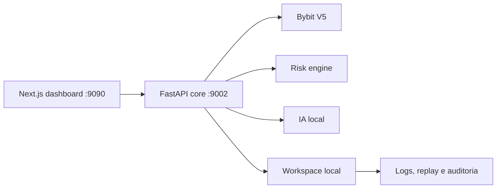
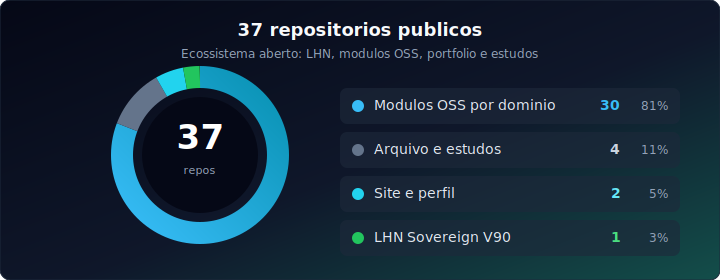

<h3>Back-end, sistemas quant, IA local e infraestrutura soberana</h3>

 

  

---

## Navegação rápida

| | Seção |
|:---:|---|
| 01 | [Quem sou](#quem-sou) |
| 02 | [Tese de engenharia](#tese-de-engenharia) |
| 03 | [LHN Sovereign V90](#lhn-sovereign-v90) |
| 04 | [Projetos principais](#projetos-principais) |
| 05 | [Stack](#stack) |
| 06 | [Mapa dos repositórios](#mapa-dos-repositórios) |
| 07 | [Atividade e contato](#atividade-e-contato) |

---

## Quem sou

Sou **Matheus Rodrigues Satriano**, graduando em **Ciência da Computação** e desenvolvedor focado em sistemas que exigem **controle, desempenho e clareza operacional**.

Meu centro de gravidade é back-end, mas eu gosto de atravessar a stack quando isso melhora o produto: APIs, painéis, motores de execução, infraestrutura local, automação, telemetria e modelos de IA rodando perto dos dados.

O que aparece com frequência nos meus projetos:

| Direção | Como isso vira código |
|---|---|
| **Baixa latência** | C++, Rust, SIMD, estruturas de dados, benchmarks e simulações de mercado |
| **IA local** | RAG offline, Ollama, pipelines self-hosted, avaliação de respostas e automação de mídia |
| **Mercado financeiro** | order book, pricing, risco, liquidez, tax-loss harvesting e dashboards operacionais |
| **Infra soberana** | Docker, Ansible, eBPF, GitOps, logs comprimidos e serviços que rodam fora da dependência de nuvem |
| **Produto real** | README forte, arquitetura documentada, testes, rotas claras e fluxo de uso reproduzível |

**Princípio pessoal:** se o problema não precisa sair da máquina, ele deve conseguir rodar local. A nuvem entra por necessidade técnica, não por reflexo.

---

## Tese de engenharia

Eu construo como quem quer operar o sistema depois. Por isso meus repositórios costumam combinar:

| Camada | Preferência técnica |
|---|---|
| **Core** | código mensurável, explícito e testável |
| **API** | contratos simples, FastAPI, OpenAPI, validação com Pydantic |
| **Interface** | Next.js, TUI em Rust ou dashboards objetivos para tomada de decisão |
| **Dados** | SQLite/PostgreSQL quando basta, Redis quando latência pede, arquivos locais quando são a solução mais honesta |
| **IA** | modelos open source, RAG offline, avaliação e isolamento do fluxo sensível |
| **Operação** | logs úteis, health checks, scripts reproduzíveis e documentação em português brasileiro |

Essa combinação aparece no meu projeto principal, o **LHN Sovereign V90**, e nos módulos independentes que orbitam o mesmo universo técnico.

---

## LHN Sovereign V90

<table>
<tr>
<td width="55%" valign="top">

<strong>LHN Sovereign V90</strong> é meu terminal quantitativo local para pesquisa, automação controlada e operação assistida em cripto.

Ele combina <strong>FastAPI</strong>, <strong>Next.js</strong>, integração com <strong>Bybit V5</strong>, camadas de risco, workspace local e módulos de IA. A ideia central é simples: manter o operador no controle, reduzir dependências externas e deixar o sistema observável.

<ul>
  <li><strong>Painel:</strong> interface web para leitura de estado, parâmetros e operação.</li>
  <li><strong>API:</strong> orquestração, configuração, risco, execução e integração externa.</li>
  <li><strong>Core:</strong> tomada de decisão, replay, backfill, radar, labeler e ciclo de treino.</li>
  <li><strong>IA local:</strong> inferência e análise próxima dos dados.</li>
  <li><strong>Workspace:</strong> persistência, auditoria, logs e artefatos operacionais.</li>
</ul>

<strong>Licença:</strong> PolyForm Noncommercial. O projeto é público, mas não é licenciado como MIT.

</td>
<td width="45%" valign="top" align="center">

  

</td>
</tr>
</table>

---

## Projetos principais

 

| Projeto | Por que ele existe | Stack dominante |
|---|---|---|
| [ultra-low-latency-order-book-engine](https://github.com/SrSatriano/ultra-low-latency-order-book-engine) | motor de order book e matching para estudar microestrutura, filas, execução e performance | C++, CMake, testes, benchmark |
| [avx512-options-pricing-engine](https://github.com/SrSatriano/avx512-options-pricing-engine) | pricing de opções com comparação entre caminho escalar e vetorização SIMD | C++, AVX-512, Monte Carlo, Black-Scholes |
| [local-rag-second-mind-vault](https://github.com/SrSatriano/local-rag-second-mind-vault) | cofre de conhecimento privado com perguntas e respostas 100% offline | Python, FastAPI, Ollama, embeddings |
| [multi-channel-analytics-dashboard](https://github.com/SrSatriano/multi-channel-analytics-dashboard) | painel para métricas, retenção, conversão e leitura executiva de canais | Next.js, TypeScript, Recharts |
| [unified-trading-super-terminal](https://github.com/SrSatriano/unified-trading-super-terminal) | terminal TUI para monitoramento de risco, posições e sinais | Rust, Ratatui |
| [high-compression-log-router](https://github.com/SrSatriano/high-compression-log-router) | ingestão e roteamento de logs com compressão eficiente | Rust, Zstd, LZ4 |
| [fiscal-data-ocr-engine](https://github.com/SrSatriano/fiscal-data-ocr-engine) | OCR e extração estruturada para documentos fiscais brasileiros | Python, OCR, validação |
| [tax-loss-harvesting-engine](https://github.com/SrSatriano/tax-loss-harvesting-engine) | simulação e regras fiscais para compensação de perdas | Node.js, TypeScript, regras BR |

---

## Stack

### Linguagens e core

  

  
  
  
  

### Web, APIs e produto

  

  
  
  
  
  

### IA, dados e automação

  
  
  
  
  
  

### Infra, DevOps e sistemas

  

  
  
  
  
  
  

### Mercado e Web3

  
  
  
  
  
  
  
  

---

## Mapa dos repositórios

  

<b>Trading, quant e mercado</b>

| Repo | Foco |
|---|---|
| [LHN-V90-IA](https://github.com/SrSatriano/LHN-V90-IA) | terminal quant principal com IA local, risco e integração Bybit |
| [ultra-low-latency-order-book-engine](https://github.com/SrSatriano/ultra-low-latency-order-book-engine) | matching engine em C++ para order book e simulação de execução |
| [smc-liquidity-scanner](https://github.com/SrSatriano/smc-liquidity-scanner) | scanner de liquidez, FVG, BOS/CHOCH e conceitos SMC |
| [unified-trading-super-terminal](https://github.com/SrSatriano/unified-trading-super-terminal) | TUI em Rust para acompanhar risco, sinais e posições |
| [avx512-options-pricing-engine](https://github.com/SrSatriano/avx512-options-pricing-engine) | precificação de opções otimizada com SIMD |
| [mempool-arbitrage-mev-bot](https://github.com/SrSatriano/mempool-arbitrage-mev-bot) | bot educacional de MEV e arbitragem em ambiente controlado |
| [chaos-engineering-trading-toolkit](https://github.com/SrSatriano/chaos-engineering-trading-toolkit) | chaos engineering aplicado a bots e ambientes de trading |
| [dark-pool-market-impact-simulator](https://github.com/SrSatriano/dark-pool-market-impact-simulator) | simulação de impacto de mercado e liquidez oculta |
| [tax-loss-harvesting-engine](https://github.com/SrSatriano/tax-loss-harvesting-engine) | regras fiscais e compensação de perdas para contexto brasileiro |

<b>IA local, mídia e avaliação</b>

| Repo | Foco |
|---|---|
| [local-rag-second-mind-vault](https://github.com/SrSatriano/local-rag-second-mind-vault) | RAG offline para conhecimento pessoal e privado |
| [distributed-ai-inference-cluster](https://github.com/SrSatriano/distributed-ai-inference-cluster) | gateway para distribuir inferência entre workers |
| [voice-cloning-tts-api-gateway](https://github.com/SrSatriano/voice-cloning-tts-api-gateway) | API de TTS e clonagem de voz self-hosted |
| [autonomous-short-form-video-pipeline](https://github.com/SrSatriano/autonomous-short-form-video-pipeline) | pipeline de vídeos curtos com roteiro, áudio e render |
| [viral-trend-sentiment-predictor](https://github.com/SrSatriano/viral-trend-sentiment-predictor) | predição de tendências e sentimento em séries temporais |
| [realtime-deepfake-streaming-bridge](https://github.com/SrSatriano/realtime-deepfake-streaming-bridge) | ponte CUDA para processamento de vídeo em tempo real |
| [cognitive-bias-hallucination-trap](https://github.com/SrSatriano/cognitive-bias-hallucination-trap) | testes adversariais e QA para respostas de LLMs |
| [algorithmic-lofi-audio-generator](https://github.com/SrSatriano/algorithmic-lofi-audio-generator) | geração procedural de trilhas lo-fi para vídeos |

<b>Produto, SaaS, fiscal BR e analytics</b>

| Repo | Foco |
|---|---|
| [multi-channel-analytics-dashboard](https://github.com/SrSatriano/multi-channel-analytics-dashboard) | dashboard full-stack para métricas e inteligência de canais |
| [fiscal-data-ocr-engine](https://github.com/SrSatriano/fiscal-data-ocr-engine) | OCR, extração e validação de documentos fiscais |
| [enterprise-b2b-saas-boilerplate](https://github.com/SrSatriano/enterprise-b2b-saas-boilerplate) | base SaaS B2B com autenticação, RBAC e multi-tenancy |
| [family-treasury-dao-tracker](https://github.com/SrSatriano/family-treasury-dao-tracker) | tesouraria, metas e projeções financeiras |

<b>Web3, identidade e segurança on-chain</b>

| Repo | Foco |
|---|---|
| [tokenomics-staking-protocol](https://github.com/SrSatriano/tokenomics-staking-protocol) | token ERC-20, staking e testes de contrato |
| [identity-vault-zk-proofs](https://github.com/SrSatriano/identity-vault-zk-proofs) | identidade com provas de conhecimento zero |
| [p2p-orderbook-gossip](https://github.com/SrSatriano/p2p-orderbook-gossip) | order book descentralizado com protocolo gossip |
| [honeypot-rugpull-analyzer](https://github.com/SrSatriano/honeypot-rugpull-analyzer) | análise estática de contratos e risco de honeypot |
| [cross-border-ledger-fabric](https://github.com/SrSatriano/cross-border-ledger-fabric) | ledger permissionado com Hyperledger Fabric |

<b>Infraestrutura, sistemas e operação</b>

| Repo | Foco |
|---|---|
| [zero-to-hero-workstation-provisioner](https://github.com/SrSatriano/zero-to-hero-workstation-provisioner) | provisionamento de workstation com Ansible |
| [ebpf-latency-tracer-financial](https://github.com/SrSatriano/ebpf-latency-tracer-financial) | tracer eBPF para latência de rede em contexto financeiro |
| [hypervisor-ai-isolation](https://github.com/SrSatriano/hypervisor-ai-isolation) | isolamento de workloads de IA em camada de virtualização |
| [gitops-infra-state-reconciler](https://github.com/SrSatriano/gitops-infra-state-reconciler) | reconciliação de estado entre Git e infraestrutura |
| [high-compression-log-router](https://github.com/SrSatriano/high-compression-log-router) | roteamento de logs com alta compressão e throughput |

<b>Arquivo, estudo e primeiros projetos</b>

| Repo | Foco |
|---|---|
| [IA-Financeira](https://github.com/SrSatriano/IA-Financeira) | primeiras explorações de IA aplicada a finanças |
| [PersonalAI](https://github.com/SrSatriano/PersonalAI) | assistente pessoal e estudos de automação |
| [calculadora-de-notas](https://github.com/SrSatriano/calculadora-de-notas) | ferramenta acadêmica utilitária |
| [Python_Senac_RIo_On](https://github.com/SrSatriano/Python_Senac_RIo_On) | exercícios e códigos de curso |
| [portfolio-matheus-satriano](https://github.com/SrSatriano/portfolio-matheus-satriano) | site público com filtros, vitrine e navegação visual |

---

## Como navegar pelo meu GitHub

| Se você quer ver | Comece por |
|---|---|
| **Sistemas de mercado e performance** | [Order Book](https://github.com/SrSatriano/ultra-low-latency-order-book-engine), [AVX-512 Pricing](https://github.com/SrSatriano/avx512-options-pricing-engine), [LHN](https://github.com/SrSatriano/LHN-V90-IA) |
| **IA local e privacidade** | [Second Mind Vault](https://github.com/SrSatriano/local-rag-second-mind-vault), [Distributed AI Inference](https://github.com/SrSatriano/distributed-ai-inference-cluster) |
| **Produto full-stack** | [Analytics Dashboard](https://github.com/SrSatriano/multi-channel-analytics-dashboard), [SaaS Boilerplate](https://github.com/SrSatriano/enterprise-b2b-saas-boilerplate) |
| **Brasil e fiscal** | [Fiscal OCR](https://github.com/SrSatriano/fiscal-data-ocr-engine), [Tax-Loss Harvesting](https://github.com/SrSatriano/tax-loss-harvesting-engine) |
| **Infra e operação** | [Log Router](https://github.com/SrSatriano/high-compression-log-router), [GitOps Reconciler](https://github.com/SrSatriano/gitops-infra-state-reconciler), [eBPF Tracer](https://github.com/SrSatriano/ebpf-latency-tracer-financial) |

---

## Atividade e contato

  

<table>
  <tr>
    <td><strong>Portfólio</strong></td>
    <td><a href="https://srsatriano.github.io/portfolio-matheus-satriano/">srsatriano.github.io/portfolio-matheus-satriano</a></td>
  </tr>
  <tr>
    <td><strong>GitHub</strong></td>
    <td><a href="https://github.com/SrSatriano">github.com/SrSatriano</a></td>
  </tr>
  <tr>
    <td><strong>LinkedIn</strong></td>
    <td><a href="https://www.linkedin.com/in/matheus-rodrigues-satriano">linkedin.com/in/matheus-rodrigues-satriano</a></td>
  </tr>
  <tr>
    <td><strong>g.dev</strong></td>
    <td><a href="https://g.dev/satriano">g.dev/satriano</a></td>
  </tr>
  <tr>
    <td><strong>E-mail</strong></td>
    <td><a href="mailto:matheussatriano@hotmail.com">matheussatriano@hotmail.com</a></td>
  </tr>
</table>

 

  

<strong>Aberto a desafios técnicos, projetos open source, back-end, sistemas quant, IA local e boas conversas sobre latência.</strong>

