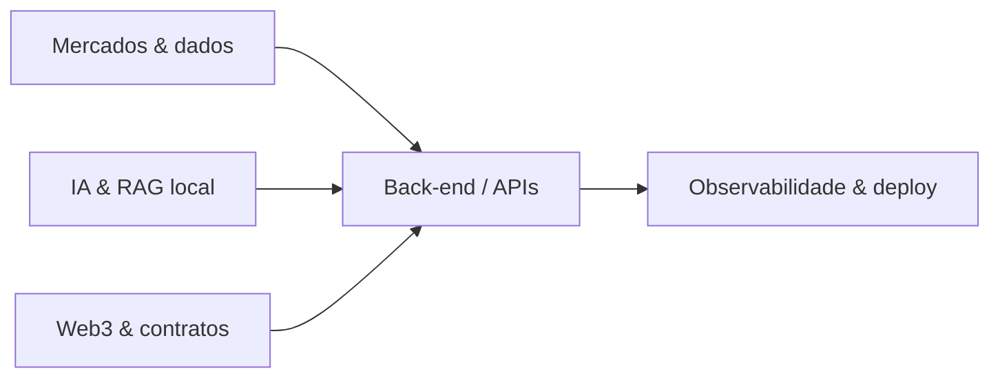

# Matheus Rodrigues Satriano

### Desenvolvedor back-end · HFT & quant · IA local · Web3

---

Olá! Sou **graduando em Ciência da Computação**, desenvolvedor **back-end** e entusiasta de **mercados financeiros**, **inteligência artificial** e **blockchain**.

Construo software com foco em **baixa latência**, **sistemas distribuídos** e **produtos que rodam de verdade** — com documentação em português, testes e CI em cada repositório.

---

## Destaques do portfólio

Repositórios open source com release **v1.0.0**, README e guias operacionais em **pt-BR**.

| Área | Projeto | Descrição |
|------|---------|-----------|
| HFT | [ultra-low-latency-order-book-engine](https://github.com/SrSatriano/ultra-low-latency-order-book-engine) | Motor de matching C++ · microssegundos |
| Quant | [avx512-options-pricing-engine](https://github.com/SrSatriano/avx512-options-pricing-engine) | Black-Scholes / Monte Carlo AVX-512 |
| IA local | [local-rag-second-mind-vault](https://github.com/SrSatriano/local-rag-second-mind-vault) | RAG offline com Ollama |
| Trading | [unified-trading-super-terminal](https://github.com/SrSatriano/unified-trading-super-terminal) | Terminal TUI em Rust (Ratatui) |
| Analytics | [multi-channel-analytics-dashboard](https://github.com/SrSatriano/multi-channel-analytics-dashboard) | Dashboard Next.js · RPM e retenção |
| Fiscal BR | [tax-loss-harvesting-engine](https://github.com/SrSatriano/tax-loss-harvesting-engine) | Harvest fiscal · wash sale |
| Fiscal BR | [fiscal-data-ocr-engine](https://github.com/SrSatriano/fiscal-data-ocr-engine) | OCR e categorização de notas |
| Infra | [high-compression-log-router](https://github.com/SrSatriano/high-compression-log-router) | Roteador de logs · Zstd/LZ4 |

<strong>Ver todos os 30 repositórios</strong>

 

| # | Repositório |
|---|-------------|
| 01 | [ultra-low-latency-order-book-engine](https://github.com/SrSatriano/ultra-low-latency-order-book-engine) |
| 02 | [smc-liquidity-scanner](https://github.com/SrSatriano/smc-liquidity-scanner) |
| 03 | [unified-trading-super-terminal](https://github.com/SrSatriano/unified-trading-super-terminal) |
| 04 | [local-rag-second-mind-vault](https://github.com/SrSatriano/local-rag-second-mind-vault) |
| 05 | [distributed-ai-inference-cluster](https://github.com/SrSatriano/distributed-ai-inference-cluster) |
| 06 | [voice-cloning-tts-api-gateway](https://github.com/SrSatriano/voice-cloning-tts-api-gateway) |
| 07 | [autonomous-short-form-video-pipeline](https://github.com/SrSatriano/autonomous-short-form-video-pipeline) |
| 08 | [viral-trend-sentiment-predictor](https://github.com/SrSatriano/viral-trend-sentiment-predictor) |
| 09 | [multi-channel-analytics-dashboard](https://github.com/SrSatriano/multi-channel-analytics-dashboard) |
| 10 | [tokenomics-staking-protocol](https://github.com/SrSatriano/tokenomics-staking-protocol) |
| 11 | [mempool-arbitrage-mev-bot](https://github.com/SrSatriano/mempool-arbitrage-mev-bot) |
| 12 | [fiscal-data-ocr-engine](https://github.com/SrSatriano/fiscal-data-ocr-engine) |
| 13 | [enterprise-b2b-saas-boilerplate](https://github.com/SrSatriano/enterprise-b2b-saas-boilerplate) |
| 14 | [family-treasury-dao-tracker](https://github.com/SrSatriano/family-treasury-dao-tracker) |
| 15 | [zero-to-hero-workstation-provisioner](https://github.com/SrSatriano/zero-to-hero-workstation-provisioner) |
| 16 | [avx512-options-pricing-engine](https://github.com/SrSatriano/avx512-options-pricing-engine) |
| 17 | [ebpf-latency-tracer-financial](https://github.com/SrSatriano/ebpf-latency-tracer-financial) |
| 18 | [hypervisor-ai-isolation](https://github.com/SrSatriano/hypervisor-ai-isolation) |
| 19 | [chaos-engineering-trading-toolkit](https://github.com/SrSatriano/chaos-engineering-trading-toolkit) |
| 20 | [dark-pool-market-impact-simulator](https://github.com/SrSatriano/dark-pool-market-impact-simulator) |
| 21 | [tax-loss-harvesting-engine](https://github.com/SrSatriano/tax-loss-harvesting-engine) |
| 22 | [identity-vault-zk-proofs](https://github.com/SrSatriano/identity-vault-zk-proofs) |
| 23 | [p2p-orderbook-gossip](https://github.com/SrSatriano/p2p-orderbook-gossip) |
| 24 | [honeypot-rugpull-analyzer](https://github.com/SrSatriano/honeypot-rugpull-analyzer) |
| 25 | [realtime-deepfake-streaming-bridge](https://github.com/SrSatriano/realtime-deepfake-streaming-bridge) |
| 26 | [cognitive-bias-hallucination-trap](https://github.com/SrSatriano/cognitive-bias-hallucination-trap) |
| 27 | [algorithmic-lofi-audio-generator](https://github.com/SrSatriano/algorithmic-lofi-audio-generator) |
| 28 | [cross-border-ledger-fabric](https://github.com/SrSatriano/cross-border-ledger-fabric) |
| 29 | [gitops-infra-state-reconciler](https://github.com/SrSatriano/gitops-infra-state-reconciler) |
| 30 | [high-compression-log-router](https://github.com/SrSatriano/high-compression-log-router) |

---

## O que eu faço

- **Back-end:** Python, Node.js, Rust, Go, C++ · APIs REST, filas, Postgres  
- **Mercados:** order book, pricing, terminals, simuladores, chaos engineering  
- **IA:** RAG offline, inferência distribuída, TTS, pipelines de vídeo  
- **Web3:** Solidity, análise de contratos, ZK, MEV educacional  
- **Infra:** Ansible, GitOps, eBPF, compressão de logs  

---

## Stack

  
  
  
  
  
  
  
  
  

Também trabalho com **R**, **SQL**, **Flask/Express**, **Next.js** e ferramentas de **ML** (PyTorch, ONNX).

---

## Formação e foco

- Graduação em **Ciência da Computação** (em andamento)  
- Interesse em **computação quântica** e algoritmos para problemas combinatórios  
- Objetivo: tecnologia aplicada a **mercados financeiros** e produtos de **IA confiável**  

---

## Contato

| | |
|---|---|
| E-mail | [matheussatriano@hotmail.com](mailto:matheussatriano@hotmail.com) |
| LinkedIn | [matheus-rodrigues-satriano](https://www.linkedin.com/in/matheus-rodrigues-satriano) |
| Google Developers | [g.dev/satriano](https://g.dev/satriano) |

  

---

## Estatísticas

  
  

  

---

  <i>“Construir sistemas rápidos, documentados e honestos sobre o que já está pronto.”</i>

